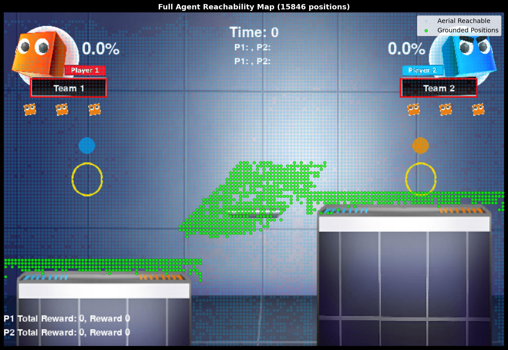
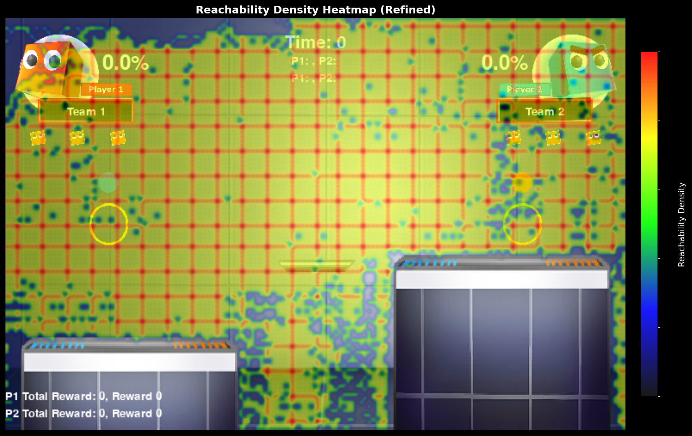

# UTMIST AI^2 — Reinforcement Learning Fighting Game Agent

An autonomous fighting game agent built for the [UTMIST AI^2 tournament](https://utmist.gitlab.io/projects/ai-squared/), trained entirely through reinforcement learning. The agent learns to navigate a 2D platform stage, approach opponents, deal damage, and win matches — starting from zero game knowledge.

Built with **PPO**, **curriculum learning**, **self-play**, and a custom **opponent modeling** system.

---

## Why PPO?

The UTMIST fighting game presents a real-time, high-dimensional action space with discrete controls (movement, attacks, specials, grabs). We chose **Proximal Policy Optimization (PPO)** for several reasons:

- **Stability over speed** — Fighting games have extremely noisy reward signals (damage is bursty, deaths are sudden, matches are long). PPO's clipped objective prevents catastrophic policy updates that would erase learned behaviors. Algorithms like DQN or SAC are more sample-efficient in theory, but tend to collapse when reward variance is this high.
- **On-policy = self-play compatible** — Our training heavily relies on self-play (training against past versions of itself). On-policy methods like PPO naturally handle non-stationary opponent distributions, since the replay buffer doesn't contain stale transitions from a different policy era.
- **Proven in similar domains** — OpenAI Five (Dota 2) and DeepMind's AlphaStar both used PPO variants for competitive game agents. The algorithm scales well with parallel environments.

We use a **3-layer MLP** (`512 → 512 → 256`) rather than a CNN because the environment provides a structured feature vector (player positions, velocities, damage, lives), not raw pixels. An MLP is faster to train and sufficient for this observation space.

---

## Curriculum Learning

The core insight: **an agent that can't walk won't learn to fight**. Early experiments with direct combat training led to agents that immediately self-destructed by walking off the stage. The agent would learn to *avoid dying* before it could learn to *deal damage*, wasting millions of training steps.

Our solution is a 9-phase curriculum that builds skills incrementally:

### Phase 0 — Navigation (5 sub-phases)

Before any combat, the agent learns to move. We freeze the opponent at a random position on the stage and reward the agent for reaching it — essentially turning the fighting game into a navigation task.

| Phase | Goal | Target Distance | Targets | Time Limit |
|-------|------|-----------------|---------|------------|
| **0a** | Walk to nearby positions | 1–2 units | 1 | 90s |
| **0b** | Jump to platforms | 3–5 units | 1 | 90s |
| **0c** | Navigate full stage | 5–12 units | 1 | 90s |
| **0d** | Reach 3 sequential targets | 1–12 units | 3 | 60s |
| **0e** | Speed runs under pressure | 1–12 units | 3 | 30s |

The fall penalty escalates across sub-phases (`-3.0` → `-8.0`), and entropy is set high (`0.1`) to encourage exploration of the full movement space. By Phase 0e, the agent can reliably traverse the entire stage without dying.

> The reachability map below was generated by recording every position the agent reached during Phase 0 training. Green dots represent grounded positions; aerial positions show the agent's jump arcs. This confirmed the agent learned to access all regions of the stage, including platforms that require precise jump sequences.

<p align="center">
  
</p>
<p align="center"><i>Full Agent Reachability Map — 15,846 unique positions visited across all navigation phases</i></p>

### Phase 1 — Learn to Approach

With navigation skills transferred, the agent enters combat. Phase 1 focuses purely on **closing distance** to the opponent while staying alive. Damage rewards are disabled entirely — the agent is only rewarded for getting closer and penalized for dying (`knockout: -3.0`).

Opponents: 90% RandomAgent (easy), 10% self-play (prevents overfitting to a single style).

**Result:** The agent learns to chase opponents across the stage without falling off. Self-destruct rate drops significantly compared to agents trained without Phase 0.

### Phase 2 — Learn to Hit

Now the agent learns to deal damage. The reward function shifts: `damage_dealt: 1.0`, `damage_taken: -0.5`. Distance reward drops from `2.0` to `0.5` — approach matters less now that the agent already knows how to close distance.

Self-play increases to 40%, forcing the agent to learn against increasingly competent versions of itself.

**Result:** The agent develops basic combo patterns and learns to punish opponent openings. Win rate against ConstantAgent reaches 70%.

### Phase 3 — Learn to Dominate

The reward function pivots hard toward winning: `win: 8.0`, `knockout: 6.0`. The opponent pool diversifies to include all agent types (RandomAgent, BasedAgent, ConstantAgent, ClockworkAgent) plus 30% self-play. Periodic evaluation against all opponents begins at this phase.

Edge penalty increases to `-1.5` to suppress the remaining self-destruct tendencies.

**Result:** The agent consistently beats RandomAgent and ClockworkAgent, and begins to compete with BasedAgent (the strongest built-in opponent).

### Phase 4 — Pure Competition

Maximum win reward (`10.0`) with a `clean_win_bonus: 5.0` for winning with positive net damage. The opponent mix is 40% BasedAgent + 40% self-play — the agent trains almost exclusively against strong opponents.

Distance reward drops to zero. The agent must win through damage and KOs, not just positioning.

**Result:** The agent demonstrates strategic behavior — retreating when at disadvantage, edge-guarding opponents, and adapting attack patterns based on opponent tendencies.

> The density heatmap below shows where the trained agent spends most of its time during matches. The concentration in the center-left and near platforms shows the agent learned to control stage positioning — staying near the center (safe) while contesting platforms (advantageous).

<p align="center">
  
</p>
<p align="center"><i>Reachability Density Heatmap — positional tendencies during trained combat. Warmer colors indicate higher visitation frequency.</i></p>

---

## Opponent Modeling

A standard MLP policy only sees the current frame. To recognize opponent patterns (does this opponent always attack after jumping? do they favor the left side?), we implemented a **Simple Context** system:

```
Observation = [game_state (64 features)] + [opponent_history (60 × 10 = 600 features)]
```

A rolling buffer stores the **last 60 opponent actions** (~2 seconds at 30fps) as one-hot encoded vectors, flattened and appended directly to the observation. This converts temporal patterns into spatial features that the MLP can learn from — no recurrent networks (LSTM/GRU) needed.

**Why not recurrent?** LSTMs are powerful but significantly slower to train with PPO (backpropagation through time, sequence batching complexity). The simple context approach gives us 80% of the benefit at 10% of the implementation cost. The agent can "see" if the opponent has been spamming attacks, standing still, or approaching — and respond accordingly.

During navigation phases, the history buffer is zeroed out (no opponent to track), but the observation space stays the same shape, allowing seamless weight transfer between phases.

---

## Environment Wrapper Stack

The training environment is built from modular wrappers, each adding a specific capability:

```
SelfPlayWarehouseBrawl        Base fighting game environment
    │
    ├── Float32Wrapper         Normalizes observations to float32
    │
    ├── FrozenOpponentWrapper  [Phase 0] Freezes opponent as nav target, adds nav rewards
    │   ── OR ──
    ├── DamageTrackingWrapper  [Phase 1-4] Tracks damage dealt/received, SD vs KO deaths
    │
    ├── OpponentHistoryWrapper  Appends 60-frame opponent action buffer to observations
    │
    ├── Monitor                 Episode statistics (SB3 standard)
    │
    └── VecFrameStack           Stacks 4 consecutive frames for temporal context
```

The `DamageTrackingWrapper` distinguishes between **self-destructs** (deaths with <20 recent damage taken) and **knockouts** (deaths from opponent attacks). This distinction is critical for diagnosing training issues — a high SD rate means the agent needs more navigation training, while a high KO rate means it needs better defensive play.

---

## Self-Play

The agent trains against a **pool of its own past checkpoints**, saved every 500k steps (keeping the last 7). During combat phases, a configurable percentage of training episodes use self-play opponents:

| Phase | Self-Play % | Purpose |
|-------|-------------|---------|
| 1 | 10% | Minimal — focus on basic skills |
| 2 | 40% | Learn against improving opponent |
| 3 | 30% | Balanced with diverse opponents |
| 4 | 40% | Maximum competitive pressure |

Self-play prevents the agent from overfitting to the fixed behavior of built-in opponents. An agent that only trains against RandomAgent will develop strategies that exploit randomness but fail against deliberate play.

---

## Results

| Opponent | Win Rate | Description |
|----------|----------|-------------|
| ConstantAgent | **70%** | Stationary opponent — tests approach and damage output |
| RandomAgent | **60%** | Random actions — tests consistency against unpredictable play |
| ClockworkAgent | **60%** | Fixed action patterns — tests pattern recognition and punishing |
| Phase 1 Model | **100%** | Earlier self — validates skill progression |
| Phase 2 Model | **100%** | Earlier self — validates skill progression |

---

## Reward Shaping Progression

The reward function evolves across phases, shifting what behavior the agent optimizes for:

| Reward Signal | Phase 1 | Phase 2 | Phase 3 | Phase 4 |
|--------------|---------|---------|---------|---------|
| Distance | **2.0** | 0.5 | 0.1 | 0.0 |
| Aggression | 0.5 | 0.2 | 0.5 | 0.2 |
| Damage Dealt | 0.0 | **1.0** | 0.3 | 0.2 |
| Damage Taken | 0.0 | -0.5 | -0.3 | -0.1 |
| Win Bonus | 0.0 | 1.0 | **8.0** | **10.0** |
| Knockout | -3.0 | 2.0 | **6.0** | 5.0 |
| Edge Penalty | -1.0 | -1.0 | -1.5 | -1.0 |
| Clean Win Bonus | — | — | — | **5.0** |

Key transitions:
- **Phase 1 → 2:** Damage rewards activate, teaching the agent that approaching isn't enough
- **Phase 2 → 3:** Win reward jumps 8x, shifting focus from individual hits to match outcomes
- **Phase 3 → 4:** Distance reward drops to zero — the agent must win through combat, not positioning

---

## Getting Started

### Prerequisites

- Python 3.10+
- PyTorch (CUDA recommended for GPU training)
- [UTMIST AI^2 environment](https://github.com/UTMIST/UTMIST-AI2-main) cloned into `UTMIST-AI2-main/`

### Installation

```bash
pip install stable-baselines3 torch gymnasium shimmy tensorboard tqdm scikit-video
```

For cloud GPU training (Vast.ai with RTX 4090):

```bash
bash setup_vast.sh
```

### Training

```bash
# 1. Set the phase in config.yaml (start with "0a")
# 2. Train
python train.py

# 3. Ctrl+C to stop — auto-saves model + records demo video
# 4. Update config.yaml: set next phase + model_checkpoint
# 5. Repeat: 0a → 0b → 0c → 0d → 0e → 1 → 2 → 3 → 4
```

### Evaluation

```bash
# Run 10 games against each opponent
python eval_10_games.py

# Watch agent play with video recording
python watch_games.py --opponent based --games 5

# Play against the agent yourself
python play_vs_agent.py
```

### Monitoring

```bash
tensorboard --logdir ./results/ppo_utmist/tb
```

---

## Project Structure

```
AI_2/
├── train.py              Main training script — PPO, curriculum, self-play
├── config.yaml           Centralized configuration (phases, rewards, hyperparameters)
├── setup_vast.sh         Cloud GPU setup script (Vast.ai)
├── eval_10_games.py      Automated evaluation against all opponents
├── watch_games.py        Watch and record agent matches
├── play_vs_agent.py      Human vs agent interactive play
├── TRAINING_GUIDE.md     Detailed training documentation
├── images/               Visualizations and analysis
├── videos/               Demo recordings
└── results/
    └── ppo_utmist/
        └── model/        Trained models (phase 1–4)
```

---

## Tech Stack

| Component | Technology |
|-----------|------------|
| RL Algorithm | PPO ([Stable Baselines 3](https://stable-baselines3.readthedocs.io/)) |
| Neural Network | PyTorch — 3-layer MLP (512 → 512 → 256) |
| Training Infra | 32 parallel environments, Vast.ai RTX 4090 |
| Monitoring | TensorBoard |
| Game Environment | UTMIST AI^2 (Gymnasium-compatible) |
